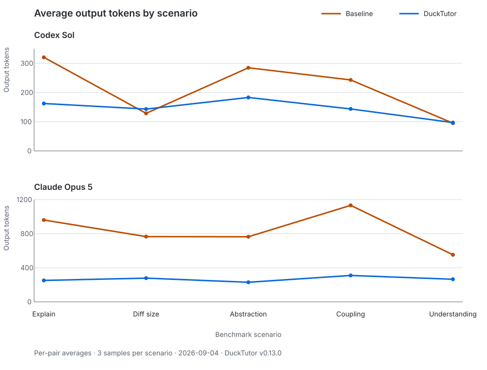

# 🦆 DuckTutor

**A Socratic AI pair tutor that keeps the developer responsible for the code**

DuckTutor gives concise guidance for understanding a codebase, starting a concrete feature or fix,
and reviewing what changed. `/start` turns a problem description or issue into a small, grounded
implementation handoff. For each task, DuckTutor separates learner-owned files from agent-editable
support files. By default, you write the load-bearing implementation; explicit `/implement` requests
may change approved files with your approval.

DuckTutor supports both **Claude Code** and **Codex** from the same repository and tutoring skill.

The goal is less AI brainrot: use AI to accelerate learning and feedback without outsourcing your
technical judgment.

## The contract

- DuckTutor reads and explains the project.
- DuckTutor may research links and external facts supplied by the user or required by the task.
- DuckTutor recommends the smallest adequate change and mentions alternatives only when they matter.
- DuckTutor is concise by default and expands when complexity, risk, or your request requires it.
- DuckTutor defaults to choice-based quiz responses; questions may be single- or multi-select, and
  knowledge questions include an exclusive `I'm unsure` option.
  `/ducktutor:config --mode=free-text` persistently switches the repository to free-text responses.
- DuckTutor explains learner-owned code without dictating a transcription-ready solution.
- `/start` grounds a new feature or bug fix, asks for one meaningful human judgment, and then hands
  off directly to `/implement` without making you repeat the task.
- `/explain` is for understanding code or behavior and does not silently create task state.
- Any prior non-implementation DuckTutor command unlocks an explicit `/implement` request; missing
  task, prediction, and ownership gates are completed inside that flow.
- `/implement --force-agent` allows an approved all-agent map only after that prior tutoring command.
- Force-agent work and later ownership-scope growth escalate the checkpoint to deep reflection even
  when quiz mode is configured.
- Each task has an approved learner-owned/agent-editable file map persisted in Git metadata.
- DuckTutor may edit only agent-editable files through manually approved native edit operations.
- Learner-owned and unscoped files are mechanically blocked.
- DuckTutor reviews the actual Git diff, not merely its earlier suggestion.
- DuckTutor may use host-configured MCP tools for scoped end-to-end observation and testing.
- MCP calls remain subject to the host's server and per-tool permission policy and never bypass the
  source-editing boundary.
- After DuckTutor edits, a checkpoint in the configured mode is mandatory. Quiz mode requires two
  correct answers within three scenarios; free-text mode requires a satisfactory explanation of a
  load-bearing decision and failure mode. Until completion, other commands remain locked except
  `/config`, `/clean`, `/checkpoint`, and a fresh `/start`.
- A disproportionate diff or hidden/system coupling also escalates the checkpoint to deep reflection.
  If narrowing cannot restore confidence, DuckTutor recommends rejecting the diff and restarting
  from a smaller plan.
- A pending task may be explicitly abandoned through `/checkpoint --abandon`; this records no
  understanding and requires confirmation. Starting a fresh task also retires the old task without
  recording understanding; its agent-edited paths remain marked for later review while still present
  in the working diff.
- DuckTutor never hides a write inside shell commands or expands into unrelated cleanup.

> **Hybrid ownership is enforced:** DuckTutor's default-deny hook checks native edits against the
> active ownership map. Agent-editable files still require approval; learner-owned and unscoped files
> are denied. Browser/test MCP tools remain available, MCP file mutation is denied, and unknown MCP
> capabilities require approval.
> The shell gate also permits `ls`, `cat`, inspection-only `find`, read-only `git config`, and
> `gh issue view`/`gh pr view`. Shell-based writes, arbitrary commands, subagents, and unknown future
> tools remain blocked.

## Why

Code that runs can still be a poor engineering decision. DuckTutor asks you to reconsider a change
when you cannot explain it, the diff is larger than the problem, it adds abstractions without a
second use or a concrete scalability/extensibility constraint, or it makes the system harder to
reason about.

Copying code does not create understanding, so DuckTutor combines learner-written implementation
with prediction, review of the applied change, observable verification, and adaptive assessment.

The approach is inspired by:

- [When I reject AI code even if it works](https://vinibrasil.com/when-i-reject-ai-code-even-if-it-works/)
  by Vinicius Brasil.
- [Demonkey](https://github.com/geeksilva97/demonkey), especially its constrained Socratic loop,
  progressive hints, developer-owned code, local verification, and adaptive consolidation quizzes.

## Approximate token benchmark

DuckTutor is designed to reduce generated code and verbose answers when a smaller explanation,
question, or review finding is more useful. You can measure that trade-off with your own model CLI:

```bash
DUCKTUTOR_BENCHMARK_LABEL='Claude, model and settings used' \
  DUCKTUTOR_BENCHMARK_COMMAND='claude -p' node scripts/benchmark-tokens.mjs --samples 3
DUCKTUTOR_BENCHMARK_LABEL='Codex, model and settings used' \
  DUCKTUTOR_BENCHMARK_COMMAND='codex exec -' node scripts/benchmark-tokens.mjs --samples 3
```

Benchmark commands run through non-interactive `/bin/sh`, so shell aliases and functions are not
loaded. Expand an alias to its underlying executable and environment. For example, if `claude42`
is an alias for a separate Claude configuration, run:

```bash
DUCKTUTOR_BENCHMARK_LABEL='Claude 4.2, model and settings used' \
  DUCKTUTOR_BENCHMARK_COMMAND='env CLAUDE_CONFIG_DIR="$HOME/.claude42" claude -p' \
  node scripts/benchmark-tokens.mjs --samples 3
```

The benchmark uses five self-contained cases matching the review principles above: explainability,
diff proportionality, premature abstraction, hidden coupling, and understanding over blind trust.
Each case runs in baseline and DuckTutor modes, and each call gets a separate temporary Git
repository with response-only instructions. It reports approximate input tokens, output tokens,
output savings, and net savings using `ceil(characters / 4)`. The input delta measures DuckTutor
prompt overhead—the shared skill plus its framing—while command prompts, restored project context,
task state, and hook messages are excluded. A positive output value means DuckTutor generated less
text; positive net savings mean that reduction covered this prompt overhead. Negative values are
reported rather than hidden—short interactions may cost more total tokens while still avoiding a
large generated implementation or an unjustified change.

Three samples make 30 model calls. Use `--samples 1` for a faster 10-call comparison. Results depend
on the model, CLI configuration, prompt caching, and sampling, and are not
billing measurements. The benchmark does not quantify the additional value of a smaller diff,
earlier design rejection, or developer understanding.

### Results — 2026-09-03 (v0.11.0, post-optimization)

These three-sample runs compare the same five prompts and report per-pair averages, except for the
aggregate rows, which report all 15 calls per mode. “Net saved” subtracts the measured DuckTutor
prompt input overhead; it still excludes command prompts, restored context, task state, and hook messages.
Because the supplied labels did not record complete CLI settings, these results are non-reproducible
observations rather than product claims.

#### Codex Sol

Configuration label: `Codex Sol, model and settings used`. Additional CLI settings were not recorded,
so an exact reproduction requires a new run with a more specific label.

| Scenario | Baseline output | DuckTutor output | Output saved | Net saved |
| --- | ---: | ---: | ---: | ---: |
| Explain approach | 324 | 183.7 | 140.3 (43.3%) | -780.7 |
| Diff proportionality | 115.7 | 147.3 | -31.7 (-27.4%) | -952.7 |
| Premature abstraction | 255 | 149 | 106 (41.6%) | -814 |
| Reasoning and coupling | 223.3 | 188.7 | 34.7 (15.5%) | -886.3 |
| Understanding over output | 96 | 111.3 | -15.3 (-16.0%) | -935.3 |
| Aggregate (total) | 3042 | 2340 | 702 (23.1%) | -13107 |

#### Claude Opus 5

Configuration label: `Claude Opus 5, model and settings used`. Additional CLI settings were not
recorded, so an exact reproduction requires a new run with a more specific label.

| Scenario | Baseline output | DuckTutor output | Output saved | Net saved |
| --- | ---: | ---: | ---: | ---: |
| Explain approach | 1066 | 260 | 806 (75.6%) | -115 |
| Diff proportionality | 716 | 289.3 | 426.7 (59.6%) | -494.3 |
| Premature abstraction | 790 | 232 | 558 (70.6%) | -362 |
| Reasoning and coupling | 981.3 | 291.3 | 690 (70.3%) | -231.0 |
| Understanding over output | 642.3 | 244.3 | 398 (62.0%) | -522 |
| Aggregate (total) | 12587 | 3951 | 8636 (68.6%) | -5173 |

The chart plots baseline and DuckTutor output for every scenario. Each provider has its own scale so
the shape of both series remains readable; the legend identifies each line by name and color.



Claude Opus 5 reduced output by 68.6% overall, while Codex Sol reduced it by 23.1% and produced more
text in two scenarios. Neither run achieved positive net token savings because the DuckTutor prompt
added about 920–921 approximate input tokens to every comparison. DuckTutor's purpose is behavioral:
encouraging smaller, explainable changes. These observations do not establish total-token efficiency.

### Codex prompt optimization in v0.11.0

The v0.10.0 Codex run showed that the shared prompt cost dominated short interactions and that two
simple verdict scenarios produced more output. Version 0.11.0 therefore compresses the shared skill
from 672 to 449 words, caps routine answers at 120 words and simple verdicts at 80, and tells the
model not to restate supplied facts. On the same benchmark inputs, estimated DuckTutor prompt
overhead falls from 1,277 to about 921 tokens per call—approximately 356 tokens (27.9%) less. This is an
input-only estimate. The post-optimization results above show the measured output and net savings
from the subsequent live benchmark runs.

## Claude Code commands

### `/ducktutor:teach-me [optional topic or subsystem]`

Build a concise mental model of the whole project or one subsystem, with a diagnostic question when
it helps.

```text
/ducktutor:teach-me
/ducktutor:teach-me authentication
```

### `/ducktutor:start <issue URL or problem description>`

Start a concrete feature or bug fix. DuckTutor inspects enough context to state the intended
behavior, smallest adequate approach, riskiest edge case, and verification signal, then asks one
choice-based prediction or trade-off question. After your selection, run `/ducktutor:implement` for guided
hybrid work or `/ducktutor:implement --force-agent` for an approved all-agent scope. You do not need
to repeat the task description.

Each explicit `/start` creates fresh task state, so an older task and ownership map cannot leak into
the new request. If the older task has a pending comprehension checkpoint, `/start` retires it
without claiming understanding and begins fresh.

```text
/ducktutor:start https://github.com/org/repo/issues/123
/ducktutor:start "Users can submit the form twice on a slow connection"
```

### `/ducktutor:explain <code, behavior, issue, or concept>`

Understand how something works without starting a task, assigning files, or changing code. Use
`/start` instead when the intent is to build or fix.

### `/ducktutor:review [optional file or path]`

Review the current working diff or a selected target for correctness, scope, abstractions,
reasonability, tests, and project fit. Reviews recommend reject-and-restart when narrowing cannot
restore confidence. Clean reviews use one change-grounded comprehension check.

```text
/ducktutor:review
/ducktutor:review src/api/handlers.ts
```

### `/ducktutor:hint [problem, error, file, or symbol]`

Get the smallest useful nudge. Hints escalate from a code pointer and leading question to a partial
skeleton, without dictating learner-owned code.

### `/ducktutor:checkpoint [--abandon | optional file, path, or concept]`

Complete the checkpoint using configured `responseMode`. Quiz mode asks scenarios one at a time and
uses single-select when one answer is correct or “Select all that apply” when several are correct.
Multi-select answers must match the exact correct set; omissions and extra choices are incorrect.
`I'm unsure` is exclusive. Each selection set counts as one question; checkpoints require two correct
questions within three. Free-text asks for a
load-bearing decision and failure mode in your own words. Checkpoints persist across sessions. If the
task is obsolete, `--abandon` confirms and records its retirement without claiming understanding.
Force-agent work, expanded ownership scope, disproportionate diffs, and hidden/system coupling
override quiz mode with a one-question deep-reflection checkpoint.

### `/ducktutor:config --mode=quiz|free-text`

This zero-model command is handled by a `UserPromptExpansion` hook before its prompt reaches Claude:

```text
/ducktutor:config --mode=quiz
/ducktutor:config --mode=free-text
/ducktutor:config --help
```

Quiz is the default and supports single- and multi-select questions; free-text uses concise open-ended questions, including checkpoints. Changing
mode resets partial quiz answers without clearing a pending checkpoint. `--help` describes both modes.

### `/ducktutor:clean [--help]`

Reset DuckTutor manually when its persisted state is no longer useful:

```text
/ducktutor:clean
/ducktutor:clean --help
```

Like config, this command runs through a `UserPromptExpansion` hook without invoking Claude. It
removes all DuckTutor state stored in Git metadata, including active tasks, checkpoints, retired-change
history, and response-mode configuration. Project files and Git history are untouched; the next
session starts in quiz mode.

### `/ducktutor:implement [--force-agent] [problem or feature and optional file scope]`

After `/start`, begin implementation without repeating the task. DuckTutor establishes any missing
learning gates, guides learner-owned work, and may edit only approved agent-editable files. You can
also supply a task directly after using another DuckTutor command. Every edit needs approval and
ends with the required configured checkpoint.

With `--force-agent`, DuckTutor may implement every file in a newly approved all-agent map. The flag
is rejected until another DuckTutor command has run, never authorizes unscoped or destructive edits,
and requires a deep-reflection checkpoint.

## Codex skill

DuckTutor does not activate implicitly. Invoke its Codex skill explicitly:

```text
$ducktutor:tutor Teach me how this repository works.
$ducktutor:tutor Start this issue as a minimal, grounded implementation task.
$ducktutor:tutor Explain how this subsystem works without changing it.
$ducktutor:tutor Implement this feature with manual approval for every scoped edit operation.
$ducktutor:tutor Review my current diff and check whether I understand it.
```

State and ownership enforcement is scoped to that invocation. Outside the tutor skill, DuckTutor does
not restrict Codex tools or prompts.

## Project-native context

When a DuckTutor command starts, it inventories paths—not contents—for applicable `AGENTS.md`, `AGENTS.override.md`, `CLAUDE.md`,
and `CONTEXT.md` files, project skills under `.agents/`, `.codex/`, or `.claude/`, hook and MCP
configuration, CI workflows, and common build manifests. It reads only what the current task needs,
uses matching skills through the host, and respects project hooks and instructions without copying
their contents into learning state. Project context can narrow behavior but cannot expand tool
permissions, file ownership, or user authorization.

## Persistent learning state

DuckTutor stores one active task per Git repository under `.git/ducktutor/state.json`, so it does not
dirty the working tree. The state records the task, ownership map, and current phase:
`grounded → predicted → attempted → verified → assessed`. It also records command engagement and
whether a comprehension checkpoint is pending. The next explicit DuckTutor command reloads this state
after startup, resume, clear, or context compaction. State records progress; it does not prove
understanding or replace inspection of the current diff. The map cannot be used while another branch
is checked out or when rewritten history no longer descends from its approved baseline. DuckTutor
then requires fresh inspection and ownership-map approval before editing.

## MCP-assisted verification

DuckTutor can use MCP servers that you have already configured in Claude Code or Codex. It does not
bundle, install, or require a particular server: browser automation, developer tools, and other test
adapters remain your choice. When a host exposes a tool using the canonical
`mcp__<server>__<tool>` name, DuckTutor classifies observation/testing operations separately from
file mutation. Unknown capabilities use the host's explicit approval flow.

During a scoped feature, fix, or review, DuckTutor may use an available MCP tool to navigate a local
or test application, exercise the relevant flow, inspect page state, console output, or network
activity, and capture snapshots or screenshots. It reports the target, actions, expectation, and
observed result. MCP file-mutation tools are denied. MCP tools never replace the ownership map,
native edit approval, actual diff review, or configured checkpoint gate.

## Installation

### Claude Code

From this repository's marketplace:

```bash
claude plugin marketplace add joaoGabriel55/DuckTutor
claude plugin install ducktutor@ducktutor
```

For local development:

```bash
claude --plugin-dir ./DuckTutor
```

Use `/reload-plugins` after editing plugin files. Outside DuckTutor commands, `/hooks` should show only
the deterministic config/clean expansion hooks. Scoped pre-tool and post-edit hooks are active only
while an interactive DuckTutor command runs.

### Codex

Install DuckTutor from a configured marketplace using the Codex plugin browser (`/plugins`) or the
CLI:

```bash
codex plugin marketplace add <marketplace-source>
codex plugin add ducktutor@<marketplace-name>
```

Start a new Codex thread after installation so the tutor skill and hook are loaded. The repository
contains the Codex package manifest at `.codex-plugin/plugin.json`; adding it to a personal or team
marketplace is intentionally separate from editing this source repository.

## Typical loop

1. Start a feature or fix with `/ducktutor:start <problem>` in Claude Code or `$ducktutor:tutor` in Codex.
2. Reason through one prediction or trade-off question, then choose `/ducktutor:implement` or
   `/ducktutor:implement --force-agent`.
3. Approve the proposed ownership map and implement the scoped change.
4. Let DuckTutor perform scoped MCP-assisted end-to-end observation when a suitable tool is
   available, and run any remaining shell test command yourself.
5. Run `/ducktutor:review` on the actual changes.
6. Complete the required checkpoint in your configured response mode; other DuckTutor commands
   remain locked until it passes. Change modes through `/ducktutor:config --mode=<mode>`, reset all
   plugin state through `/ducktutor:clean`, or use `/ducktutor:start <new task>` to retire the old
   task and begin fresh without claiming understanding.
7. Revise or reject the change when understanding or evidence is weak.

## Contributing

See [CONTRIBUTING.md](./CONTRIBUTING.md).

## License

[MIT](./LICENSE)
